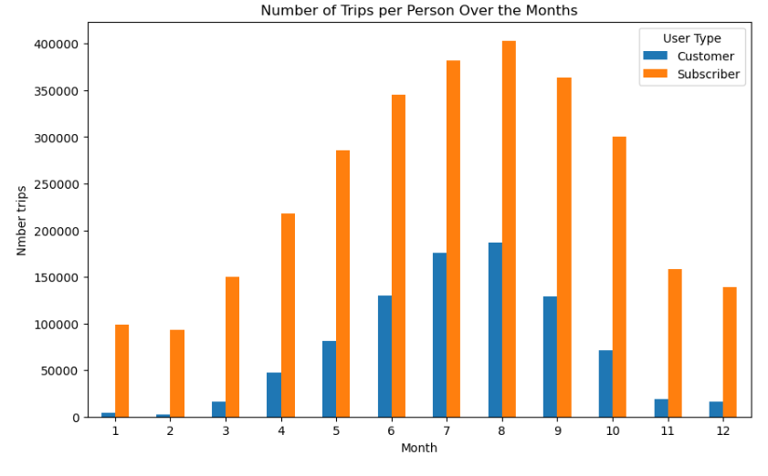

# Divvy Trips
Hello, this was my capstone project I created to finish my Google Data Analytics Certification.  
title: GDA Capstone - Cyclistic  
author: Felipe André de Quadros  
date: 12/08/2023  
  
Link project in Kaggle [here](https://www.kaggle.com/code/felipequadros/divvy-trips-rev00)
  
# Introduction and Study Objective
This is the capstone project part of the Google Analytical Certificate Course.

## Ask
The case study is to Study the pattern of annual member and non-member riders to define the marketing strategy of bringing the non-member into the member program.

The following three questions would help in directing the future marketing Program.

How do annual members and casual riders use Cyclistic bikes differently?
Why would casual riders buy Cyclistic annual memberships?
How can Cyclistic use digital media to influence casual riders to become members?
Tool followed:- Excel(Power-Pivot & Power Query), and Python.

## Prepare
Data set obtained from the link Data set from Quarter # 2 of 2019 to Quarter # 1 of 2020 were downloaded from the link and stored on the local desktop.

## Process
Following steps were performed in Pyhton, and the final file was extracted for final analysis

* Made the columns’ name uniform across the file.
* Before merging the files, remove any extra columns that are not common to all files.
* Merge the column into one file using the full outer join
* Extracted the file as CSV, and the same file was used for the analysis The file was ready to use for the analysis.
* Pre-Data analysis:- we created the following columns.
* Ride Length in seconds – This was done by subtracting the ride’s start time from to end time.
* Weekday – calculated from the start time column.
* Day name – calculated from the start time column.
* Day number – calculated from the start time column.
* Year – calculated from the start time column.
* Mouth –  calculated from the end time column.


## Start code

### Import librarys for dataframes.
```py
import numpy as np 
import pandas as pd 

import os
for dirname, _, filenames in os.walk('/kaggle/input'):
    for filename in filenames:
        print(os.path.join(dirname, filename))
```


## Import files

```py
df1 = pd.read_csv("/kaggle/input/cyclistic-bikeshare-analysis-case-study/Divvy_Trips_2019_Q1.csv")
df2 = pd.read_csv("/kaggle/input/cyclistic-bikeshare-analysis-case-study/Divvy_Trips_2019_Q2.csv")
df3 = pd.read_csv("/kaggle/input/cyclistic-bikeshare-analysis-case-study/Divvy_Trips_2019_Q3.csv")
df4 = pd.read_csv("/kaggle/input/cyclistic-bikeshare-analysis-case-study/Divvy_Trips_2019_Q4.csv")
```

## Checking the header
```py
df1.head()
```


```py
df2.head()
```


```py
df3.head()
```


```py
df4.head()
```


## Checking the size
```py
a, b, c, d = df1.shape, df2.shape, df3.shape, df4.shape
print(f'Size dataframe 1: {a}, \n Size dataframe 2: {b}. \n Size dataframe 3: {c}.\n Size dataframe 4: {d}.')
```
_Size dataframe 1: (365069, 12),_
_Size dataframe 2: (1108163, 12)._
_Size dataframe 3: (1640718, 12)._
_Size dataframe 4: (704054, 12)._


## Checking the data type of each dataframe
```py
a1, b1, c1, d1 = df1.dtypes, df2.dtypes, df3.dtypes, df4.dtypes
print(a1)
print(b1)
print(c1)
print(d1)
```


## Renaming DF2 columns
Renaming DF2 columns to match other dataframes

```py
df2.rename(columns={'01 - Rental Details Rental ID': 'trip_id', 
                   '01 - Rental Details Local Start Time': 'start_time',
                   '01 - Rental Details Local End Time': 'end_time', 
                   '01 - Rental Details Bike ID': 'bikeid',
                   '01 - Rental Details Duration In Seconds Uncapped': 'tripduration',
                   '03 - Rental Start Station ID': 'from_station_id',
                   '03 - Rental Start Station Name': 'from_station_name',
                   '02 - Rental End Station ID': 'to_station_id',
                   '02 - Rental End Station Name': 'to_station_name',
                   'User Type': 'usertype',
                   'Member Gender': 'gender',
                   '05 - Member Details Member Birthday Year': 'birthyear'}, 
          inplace=True)
df2.head()
```


## Merge the dataframes into one
```py
m = pd.concat([df1,df2, df3, df4], ignore_index = True)
m.shape
```
_(3818004, 12)_

## Changing the data type for the bikeid column
```py
m.bikeid=m.bikeid.astype(str)
m.dtypes
```


## Inclusion of date columns
* alltrips_date, 
* alltrips_year, 
* alltrips_month, 
* alltrips_day, 
* alltrips_dayOfWeek

```py
from time import time
from datetime import datetime
```

```py
m['start_time'] = pd.to_datetime(m['start_time'])
m['end_time'] = pd.to_datetime(m['end_time'])
```


```py
#Date
m.insert(4, "alltrips_date", m.end_time.dt.date)

#Year
m.insert(5, "alltrips_year", m.end_time.dt.year)

#Month
m.insert(6, "alltrips_month", m.end_time.dt.month)

#Day number
m.insert(7, "alltrips_day", m.end_time.dt.day)

#Day of week number
m.insert(8, "alltrips_dayOfWeek", m.end_time.dt.weekday)
```

```py
#Add time difference column in seconds (alltripsRideLength)
m.insert(4, "alltripsRideLength", (m.end_time - m.start_time).dt.total_seconds())
m.head()
```


## Copy from dataframe without considering 0 values
Create a copy of the original df, removing trip values equal to or less than 0

```py
# Copia o dataframe, excluindo linhas com valores zerados
df_copy = m[m['alltripsRideLength'] > 0].copy()
df_copy.shape
```
_(3817991, 18)_


# Descriptive analysis
Some descriptive analysis, such as travel times and difference in user types

```py
avgTrips = df_copy.alltripsRideLength.mean()
medianTrips = df_copy.alltripsRideLength.median()
maxTrips = df_copy.alltripsRideLength.max()
minTrips = df_copy.alltripsRideLength.min()
print(f'Average (s):{avgTrips:.2f}, Median (s): {medianTrips:.2f}, Max time trips (s):{maxTrips:.2f}, Min time trips (s):{minTrips:.2f} ')
```
_Average (s):1450.47, Median (s): 709.00, Max time trips (s):10632022.00, Min time trips (s):61.00_


```py
statistic_usertype = df_copy.groupby('usertype')['alltripsRideLength'].agg(['mean', 'median', 'max', 'min']).reset_index()
print(statistic_usertype)
```
usertype         mean       median         max   min <br/>  
0    Customer  3421.081143  1550.0  10632022.0  61.0 <br/>  
1  Subscriber   859.668071   588.0   9056634.0  61.0 <br/>  


# Data visualization
```py
import matplotlib.pyplot 
```

```py
#Bar graph
#Vector with the names of the days of the week, to replace the number of the day with the name of the day
day_week = {1: 'Sunday', 2: 'Monday', 3: 'Tuesday', 4: 'Wednesday', 5: 'Thursday', 6: 'Friday', 0: 'Saturday'}


# Filters the dataframe only for the relevant columns
df_filtrado = df_copy[['alltrips_dayOfWeek', 'usertype']].copy()

# Maps weekday numbers to corresponding names
df_filtrado.loc[:, 'alltrips_dayOfWeek'] = df_filtrado['alltrips_dayOfWeek'].replace(day_week)

# Groups data by day of week and name, and calculates trip count
count_by_day_week = df_filtrado.groupby(['alltrips_dayOfWeek', 'usertype']).size().unstack()

# Plot grapf
x = np.arange(len(count_by_day_week))
width = 0.4

fig, ax = plt.subplots()
rects1 = ax.bar(x - width/2, count_by_day_week['Subscriber'], width, label='Subscriber')
rects2 = ax.bar(x + width/2, count_by_day_week['Customer'], width, label='Customer')

ax.set_title('Number of trips for Day of week')
ax.set_xlabel('Day week')
ax.set_ylabel('Number of trips')
ax.set_xticks(x)
ax.set_xticklabels(count_by_day_week.index)
ax.legend()
fig.tight_layout()
plt.show()
```


```py
#bar chart for comparing users by months of the year
df_filtrado2 = df_copy[['alltrips_month', 'usertype']]

# Groups data by day of week and name, and calculates trip count
count_per_month = df_filtrado2.groupby(['alltrips_month', 'usertype']).size().unstack()

count_per_month.plot(kind='bar', figsize=(10, 6))
plt.title('Number of Trips per Person Over the Months')
plt.xlabel('Month')
plt.ylabel('Nmber trips')
plt.xticks(rotation=0)
plt.legend(title='User Type')
plt.show()
```



```py
#places with the most trips (start and destinations)
travel_by_start_location = df_copy['from_station_name'].value_counts().nlargest(10).sort_values(ascending=True)
travel_by_place_destination = df_copy['to_station_name'].value_counts().nlargest(10).sort_values(ascending=True)

# Graphics configuration
fig, axes = plt.subplots(nrows=1, ncols=2, figsize=(15, 6))

# Graph of the top 10 most tripped start locations
axes[0].barh(travel_by_start_location.index[:10], travel_by_start_location[:10], color='blue')
axes[0].set_title('Top 10 Most Traveled Start Places')
axes[0].set_xlabel('Number of trips')
axes[0].set_ylabel('Start Places')

# Graph of the 10 destinations with the most trips
axes[1].barh(travel_by_place_destination.index[:10], travel_by_place_destination[:10], color='orange')
axes[1].set_title('Top 10 Most Traveled Destinations')
axes[1].set_xlabel('Number of trips')
axes[1].set_ylabel('Destinations')
plt.tight_layout()
plt.show()
```


```py
#Boxplot graph

#filter larger time values greater than 1:30h
df_copy_2 = df_copy[df_copy['alltripsRideLength'] < 5400].copy()

#Graph boxplot
plt.figure(figsize=(8, 6))
plt.boxplot([df_copy_2[df_copy_2['usertype'] == 'Subscriber']['alltripsRideLength'], df_copy_2[df_copy_2['usertype'] == 'Customer']['alltripsRideLength']],
            labels=['Subscriber', 'Customer'])
plt.title('Trip Duration Boxplot by UserType')
plt.xlabel('Usertype')
plt.ylabel('Trip duration (seconds)')
plt.show()
```


This provides us with enough numbers and visuals to generate data-driven decisions and make a compelling presentation for our stakeholders.

I hope this was helpful!

**Thanks for all!**


